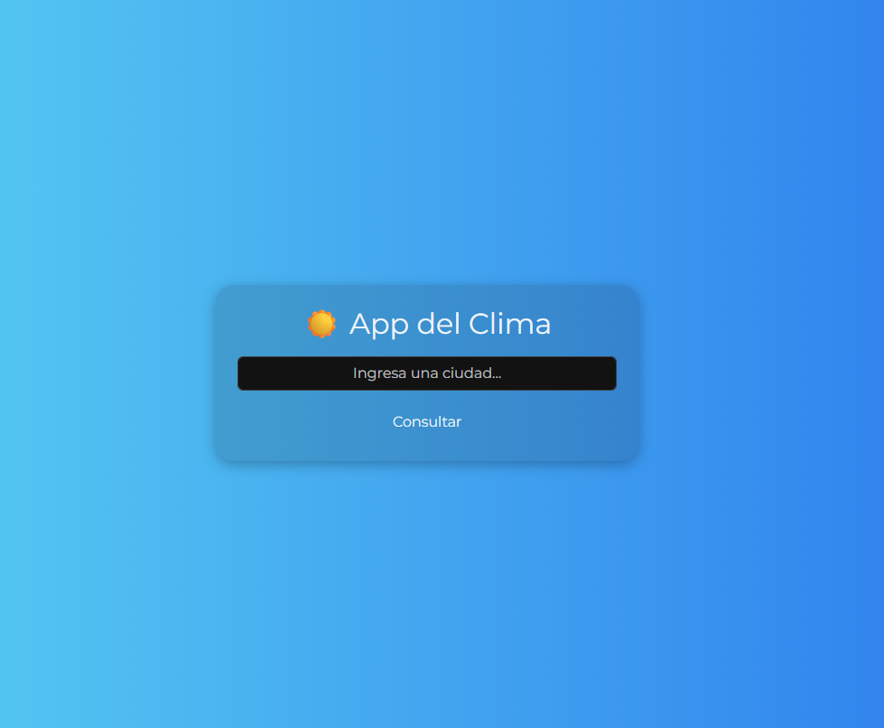
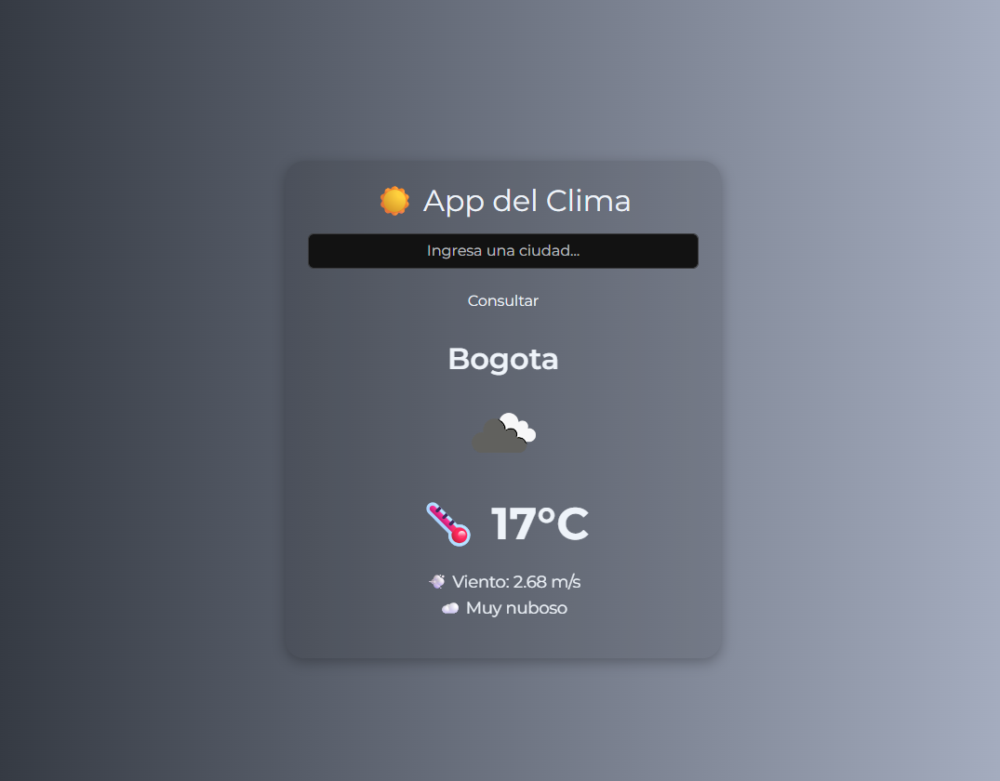
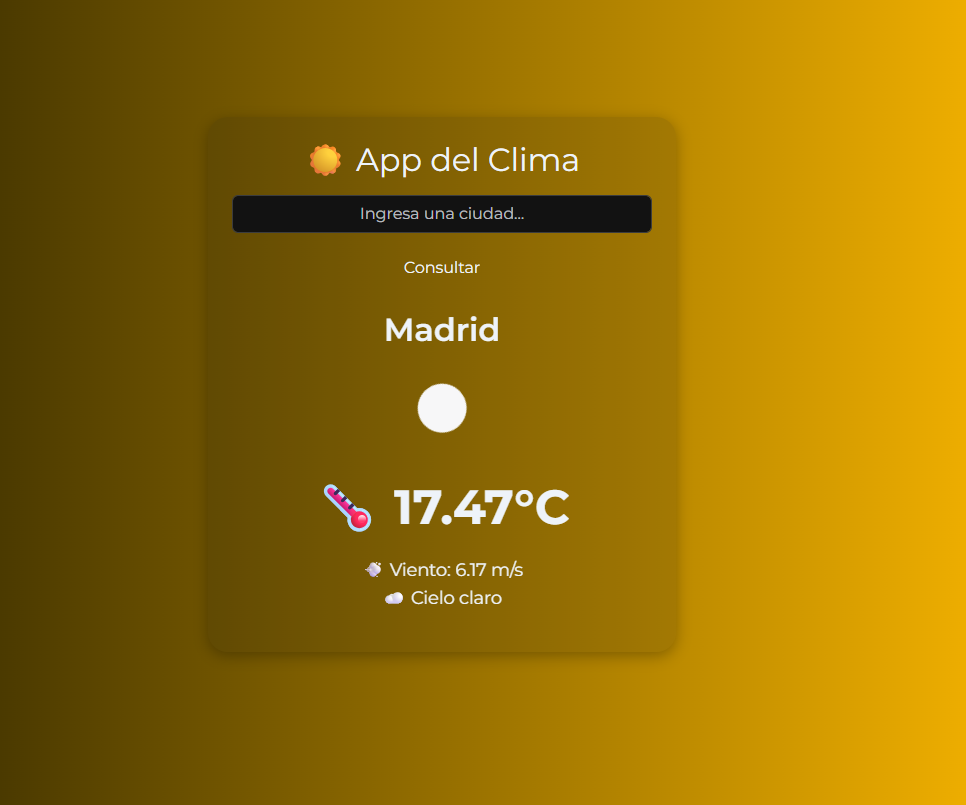

<h1 align="center">🌤️ App Clima</h1>

<p align="center">
  <strong>Aplicación web sencilla</strong> para consultar el clima actual de cualquier ciudad.<br>
  Desarrollada con <b>Flask</b>, <b>HTML/CSS</b> y <b>OpenWeatherMap API</b>.
</p>

<p align="center">
  
  
  
  
  
</p>

---

🌟 **App Clima** permite consultar la temperatura, sensación térmica, humedad, descripción del clima y hora local de cualquier ciudad.  
Ideal para practicar **Flask, consumo de APIs externas y diseño web responsivo**.


La app muestra:

- 🌡️ Temperatura actual
- 💨 Velocidad del viento
- ☁️ Descripción del clima
- 🌞 Íconos animados según el clima (sol girando, nubes flotando)
- 🎨 Fondo dinámico según la condición meteorológica
- ✨ Animaciones suaves y feedback de carga

---

## 💻 Tecnologías utilizadas

<div align="center">

| 🧩 Tecnología | 💡 Descripción | 🌐 Uso principal |
|:--------------|:----------------|:----------------|
| 🐍 **Python 3** | Lenguaje principal | Lógica backend con Flask |
| ⚙️ **Flask** | Framework ligero para desarrollo web | Creación del servidor y rutas |
| 🌤️ **OpenWeatherMap API** | API para datos climáticos | Obtener datos del clima en tiempo real |
| 🎨 **Bootstrap 5** | Librería CSS responsive | Diseño visual y estructura de la app |
| 🌐 **HTML5 + CSS3** | Lenguajes base del frontend | Maquetación de la página y estilos |
| 📡 **Requests (Python)** | Librería HTTP | Consumir la API de OpenWeatherMap |

</div>

---
## 🗂️ Estructura del proyecto

<div align="left">

```bash
app_clima/
│
├── 📁 static/                # Archivos estáticos (CSS, imágenes)
│
├── 📁 templates/             # Plantillas HTML
│   └── index.html            # Página principal
│
├── ⚙️ app.py                 # Archivo principal de Flask
│
├── 🧾 requirements.txt       # Librerías necesarias
│
└── 🧠 README.md              # Documentación del proyecto
```
</div>

---

## ⚙️ Instalación y ejecución

1. **Clonar el repositorio:**

Sigue estos pasos para ejecutar **App Clima** localmente 🧠👇

### 🪄 1️⃣ Clonar el repositorio
```bash
git clone https://github.com/iparra-sys/app_clima.git
cd app_clima
```

### 🧰 2️⃣ Crear y activar entorno virtual

```bash
python -m venv venv
# Activar entorno (Windows)
venv\Scripts\activate
# Activar entorno (Linux/Mac)
source venv/bin/activate

```
### 📦 3️⃣ Instalar dependencias
```bash
pip install -r requirements.txt
```
### 🔑 4️⃣ Configurar la API Key
1.Crear un archivo .env en la raíz del proyecto.
2.Agregar tu API Key de OpenWeatherMap:
```bash
API_KEY=TU_API_KEY
```
### 🚀 5️⃣ Ejecutar la aplicación
```bash
python app.py
```
### Abre el navegador y visita 👉 http://127.0.0.1:5000
---

## 🚀 Características principales

<div align="center">

| 💡 Funcionalidad | 🧩 Descripción |
|------------------|----------------|
| 🌡️ **Temperatura y clima** | Muestra la temperatura actual, sensación térmica y descripción del clima. |
| 📍 **Búsqueda por ciudad y país** | Permite consultar cualquier ubicación con formato `Ciudad, País`. |
| ⏰ **Hora local** | Muestra la hora local de la ciudad consultada. |
| 🎨 **Diseño responsivo** | Interfaz limpia y adaptable a cualquier dispositivo usando **Bootstrap 5**. |
| ⚙️ **Flask Backend** | Controla la lógica de la aplicación y la integración con la API. |
| 🔍 **Código modular** | Estructura clara, fácil de mantener y ampliar con nuevas funcionalidades. |

</div>

---

## 🖼️ Vista previa de la app

💡 A continuación puedes ver cómo se visualiza la aplicación en funcionamiento.  
Muestra la **pantalla principal** y los resultados de consultas de diferentes ciudades.

<p align="center">
  
</p>

<p align="center">
  
  
</p>

---
## 🔮 Próximas mejoras

Estas son algunas funcionalidades planificadas para futuras versiones de **App Clima**:

- 🌡️ Pronóstico extendido por varios días.  
- 🧾 Historial de búsquedas recientes.  
- 🎨 Mejoras en el diseño y animaciones dinámicas.  
- 🌐 Internacionalización y soporte para múltiples idiomas.  
- ⚡ Optimización de rendimiento y tiempos de respuesta.  
---

## 👩‍💻 Autora

**Iveth Parra Herrera**  
Desarrolladora en formación | Backend & Frontend Junior  
📍 Colombia  
🔗 [LinkedIn](https://www.linkedin.com/in/iveth-parra-herrera-351a6a235)  
💻 [GitHub](https://github.com/iparra-sys)

✨ Proyecto desarrollado como parte del Portafolio 2025 - Iveth Parra Herrera ✨

💡 *“El código es una herramienta para construir soluciones reales y dejar huella.”*  


